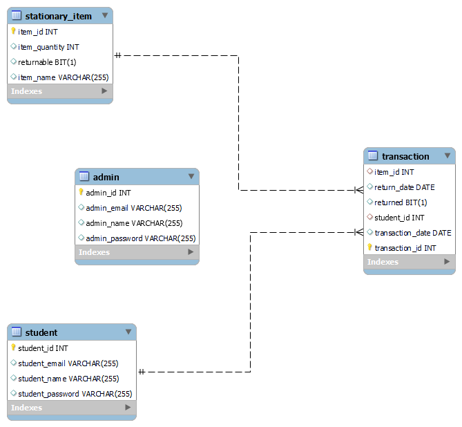

### End Points

    1. admin signup -    http://[hostname:port]/api/admin/register         (Method - POST)
    2. admin login  -    http://[hostname:port]/api/admin/login            (Method - POST)

    3. saving Item  -    http://[hostname:port]/api/stationaryItem/save    (Method - POST)
    4. fetch Item  -     http://[hostname:port]/api/stationaryItem/[id]    (Method - GET)
    5. fetch all Items - http://[hostname:port]/api/stationaryItem         (Method - GET)
    6. update Item -     http://[hostname:port]/api/stationaryItem/[id]    (Method - PATCH)
    7. delete Item  -    http://[hostname:port]/api/stationaryItem/[id]    (Method - DELETE)

    8. student signup -   http://[hostname:port]/api/student/register        (Method - POST)
    9. student login -   http://[hostname:port]/api/student/login           (Method - POST)

