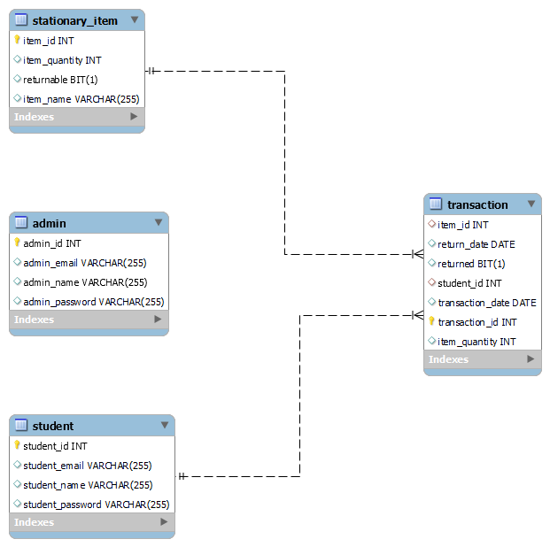

### End Points

    1. admin signup -    http://[hostname:port]/api/admin/register         (Method - POST)
    2. admin login  -    http://[hostname:port]/api/admin/login            (Method - POST)

    3. saving Item  -    http://[hostname:port]/api/stationaryItem/save    (Method - POST)
    4. fetch Item  -     http://[hostname:port]/api/stationaryItem/[id]    (Method - GET)
    5. fetch all Items - http://[hostname:port]/api/stationaryItem         (Method - GET)
    6. update Item -     http://[hostname:port]/api/stationaryItem/[id]    (Method - PATCH)
    7. delete Item  -    http://[hostname:port]/api/stationaryItem/[id]    (Method - DELETE)
   
    8. student signup -   http://[hostname:port]/api/student/register        (Method - POST)
    9.  student login -   http://[hostname:port]/api/student/login           (Method - POST)

### Transaction

    1. create Transaction   - http://[hostname:port]/api/transaction/[studentId]        (Method - POST)
    
        {
            "stationaryItemId":"1",
            "withdrawnQuantity":35,
            "returnDate":"2023-07-20",
            "returned":"false"
        }  

    2. findOneTransaction    -  http://[hostname:port]/api/transaction/[transactionId]              (Method - GET)
    3. findAllTransaction    -  http://[hostname:port]/api/transaction/                             (Method - GET)
    4. findAllByStudentId    -  http://[hostname:port]/api/transaction/all/byStudentId?id=1         (Method - GET)
    5. findAllByItemId       -  http://[hostname:port]/api/transaction/all/byItemId?id=1            (Method - GET)
    6. UpdateOneTransaction  -  http://[hostname:port]/api/transaction/[studentId]                  (Method - PATCH)

        {
            "transactionId":7,  //(must)
            "returned": true,   //(optional)
            "returnDate":"2023-07-20"   //(optional)
        }

